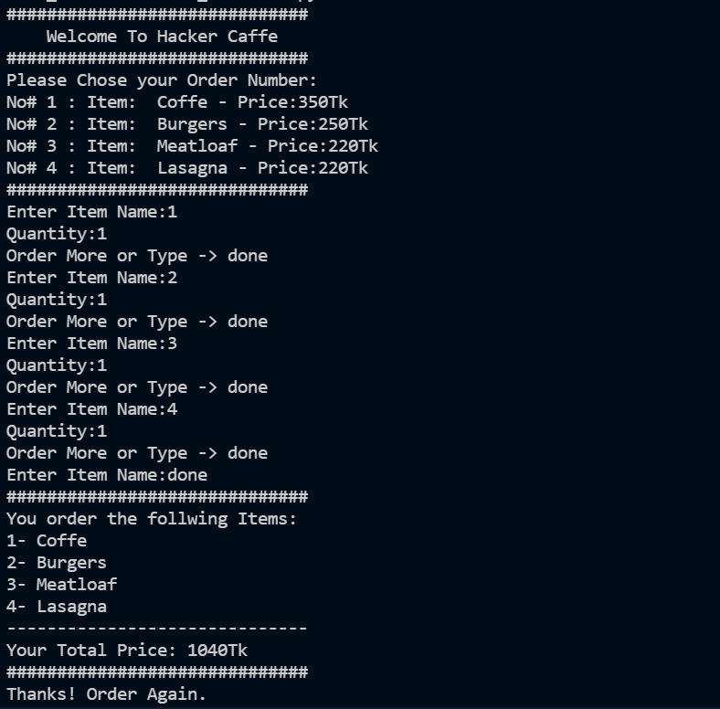

# Project Name: Restaurent Order System

Simple restaurent order system to add and calculated order item and show. 

## Description
The system is developed using python. Main goal is to implement the python basic knowlege and creat a system using the basic function, dictionary, list.
Leaning and implementing new feaures in this samll project is my mission.

## Sample Output

